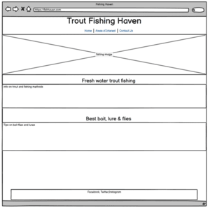
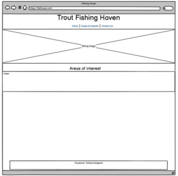
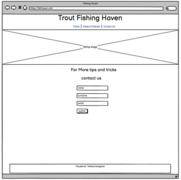
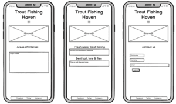

# Trout Fishing Haven

Trout Fishing Haven is a website to give you an overview what and how to catch that trout of your dreams. Get information on the methods and different lures needed as well as the tricks on how to catch that monster.

# [Live web page](https://grahammaher.github.io/Trout-Fishing-Haven/)

# Table Of Contents
1. [Trout Fishing Haven](#trout-fishing-haven)
2. [Launch the Website](#live-web-page)
3. [Overview](#overview)
4. [Planning](#planning)
5. [Design](#design)
   - [Header](#header)
   - [Colours](#colours)
   - [Imagery](#imagery)
   - [Main Font](#main-font)
   - [Back-up Fonts](#back-up-fonts)

          
# Overview
Trout Fishing Haven is a fictional website created for Project Portfolio 1.
- Website consists of 3 seperate HTML pages all linked together through the use of the nav menu.
- Purpose of the website is to provide new or experienced anglers the information about trout fishing.
- Pages consist of :
  - main index.html that contains information on methods, bait and what freshwater trout fishing is about.
  - areas-of-interest.html that contains some highly rated lakes in Ireland and some additional information about the areas.
  - contact-us.html that is used to sign up for some more information and tips if the user wishes.

# Planning
   ## Wireframes
   

    
Desktop Wireframes

     
     
     
   

   

    
Mobile Wireframes

     
   

# Design
 - ## Header
   Header font was chosen to look relaced and informal as fishng is meant to be a relaxing past time. Poetsen One font format was imported from Google Fonts.
 - ## Colours
   Colours of the website were chosen to represent the different colours of a lake or river.
 - ## Imagery
   Imagery that was used on the website are the showing areas, equipment and actual trout fishing in order to show the art of fishing.
- ## Main Font
   Main font was chosen to be a bit more formal as it is providing factual information. Playfair Display font format was imported for Google Fonts.
- ## Back-up Fonts
   Seriff and Sans-Seriff were chosen as back-up fonts for the main font and header respectively.

# Navigation Menu

