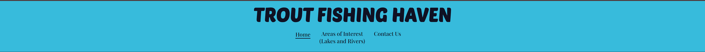
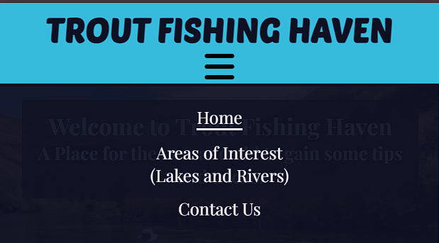
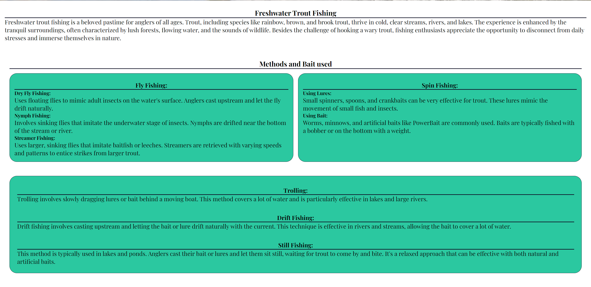
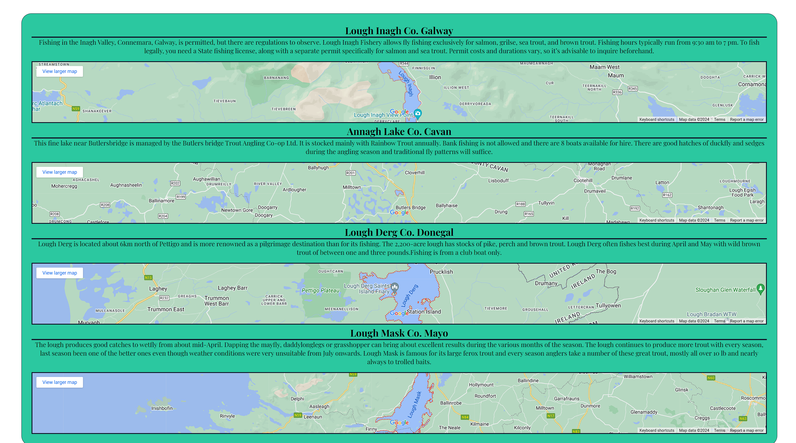
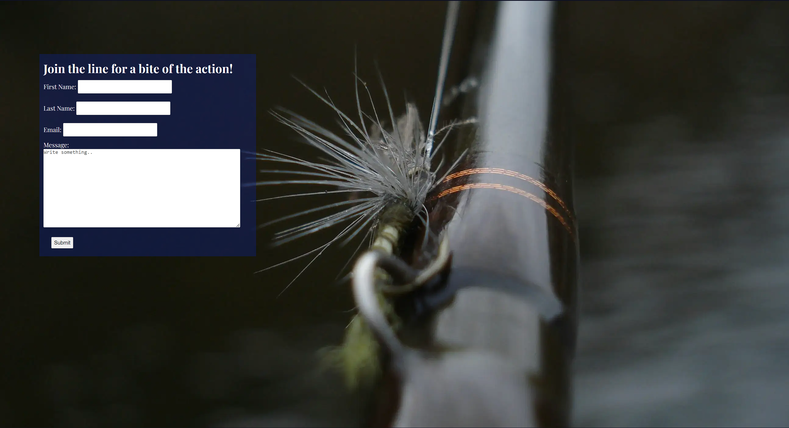

# Trout Fishing Haven

Trout Fishing Haven is a website to give you an overview what and how to catch that trout of your dreams. Get information on the methods and different lures needed as well as the tricks on how to catch that monster.

# [Live web page](https://grahammaher.github.io/Trout-Fishing-Haven/)

# Table Of Contents
1. [Trout Fishing Haven](#trout-fishing-haven)
2. [Launch the Website](#live-web-page)
3. [Overview](#overview)
4. [Planning](#planning)
5. [Design](#design)
   - [Header](#header)
   - [Colours](#colours)
   - [Imagery](#imagery)
   - [Main Font](#main-font)
   - [Back-up Fonts](#back-up-fonts)
6. [Navigation Menu](#navigation-menu)
7. [Welcome Image](#welcome-image) 
8. [Main Content](#main-content) 
9. [Areas of Interest](#areas-of-interest)
10. [Contact Us](#contact-us)
11. [Footer](#footer)        
# Overview
Trout Fishing Haven is a fictional website created for Project Portfolio 1.
- Website consists of 3 seperate HTML pages all linked together through the use of the nav menu.
- Purpose of the website is to provide new or experienced anglers the information about trout fishing.
- Pages consist of :
  - main index.html that contains information on methods, bait and what freshwater trout fishing is about.
  - areas-of-interest.html that contains some highly rated lakes in Ireland and some additional information about the areas.
  - contact-us.html that is used to sign up for some more information and tips if the user wishes.

# Planning
   ## Wireframes
   

    
Desktop Wireframes

     
     
     
   

   

    
Mobile Wireframes

     
   

# Design
 - ## Header
   Header font was chosen to look relaced and informal as fishng is meant to be a relaxing past time. Poetsen One font format was imported from Google Fonts.
 - ## Colours
   Colours of the website were chosen to represent the different colours of a lake or river.
 - ## Imagery
   Imagery that was used on the website are the showing areas, equipment and actual trout fishing in order to show the art of fishing.
- ## Main Font
   Main font was chosen to be a bit more formal as it is providing factual information. Playfair Display font format was imported for Google Fonts.
- ## Back-up Fonts
   Seriff and Sans-Seriff were chosen as back-up fonts for the main font and header respectively.

# Navigation Menu
  - Navigation menu located in the top and center of the page below the main header for easy of viewing.
  - Fixed position to the top of the page for use while scrolling incase the user wants to go to another page.
  - When viewing the navigation menu on a mobile screen it is hidden inside of a burger icon drop down menu in order to save space.

  ### Large screen navigation menu
  

  ### Mobile screen navigation menu closed
  

  ### Mobile screen navigation menu open
  

# Welcome image
  

# Main content
  - Main content describes freshwater fishing, the methods and the different types of lures that can be used for those who are new or experienced fisherman wanting to try something new.
    The 2 ways of fishing are split into their own boxes and the following three methods are contained in a seperate box.
   

# Areas of Interest
  - Different image at the top of page is used to differentiate between the pages
  
  - Areas of Interest have maps imbedded from Google Maps of various lakes, when clicked on a new tab will open with the map from Google giving direction etc.
  

# Contact Us
  -Contact us form is used for visitors to send a message with your name and email address to a professional for any queries. All fields of the form require an input in order to submit.
  The form does not currently push to a server or website.
  

# Footer
  - Footer currently links to social media and opens it in a new tab. Currently no social media accounts exist.
  

